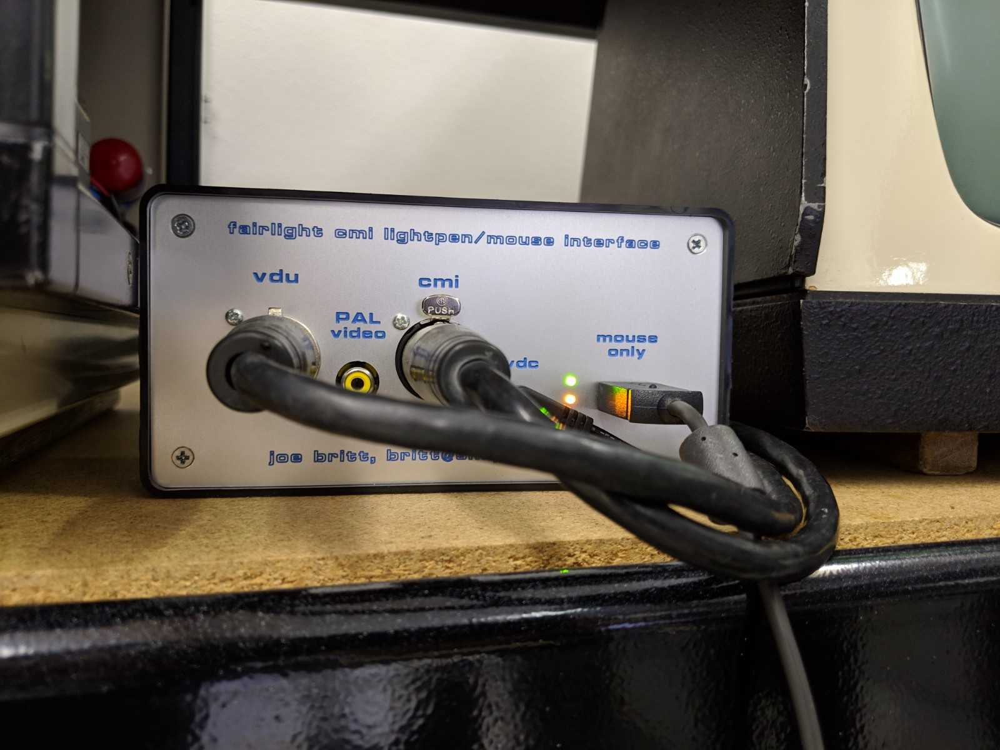
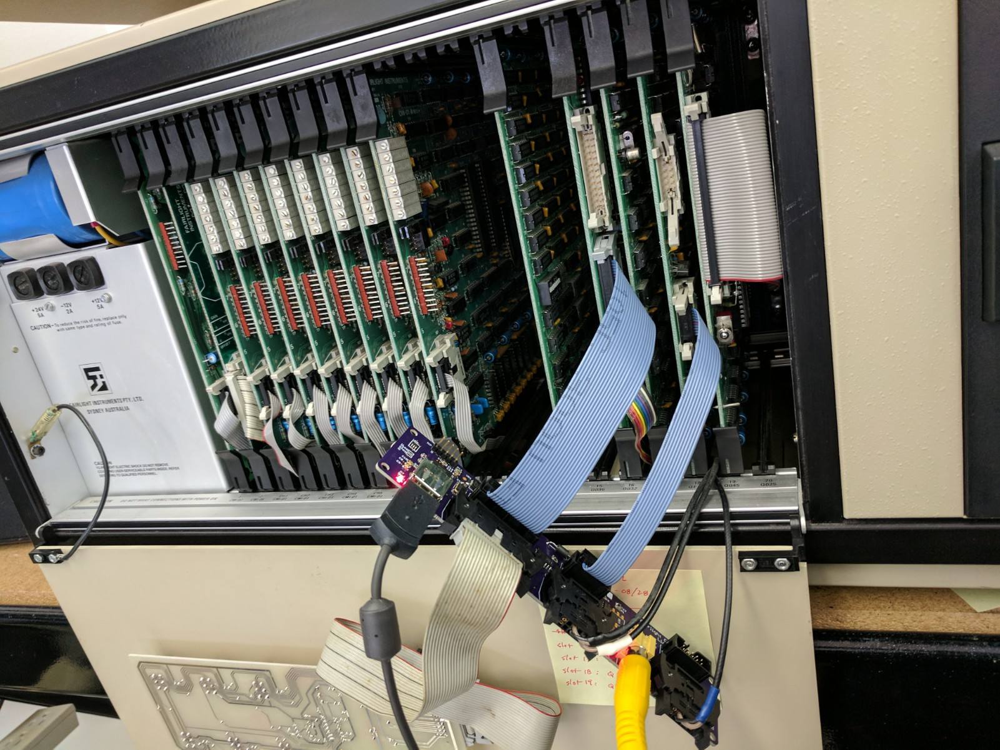

# usb2cmi_lightpen
Use a USB mouse instead of (or in conjunction with) the lightpen on a Fairlight CMI.

  
  

## Firmware

Some work will be needed to get the code to build with the latest Microchip MPLAB X tools,
so I recommend installing the v8.63 release of MPLAB (pre-MPLAB X). 

Microchip is good about making legacy tools available, you can find version 8.63 here:

https://www.microchip.com/development-tools/pic-and-dspic-downloads-archive

*You don't have to build the code from source:*

In the "prebuilt_hexfiles" folder are pre-compiled images of the bootloader and lightpen emulation application.

To use these:

- Use the Microchip tools to flash bootloader.hex into the PIC32.
- Put cmimouse.hex on a USB thumbdrive (formatted with a DOS/FAT filesystem).
- Plug the thumbdrive into the interface USB port and power up the board.
- You should see the leds blink back and forth, then the cmimouse.hex file will be copied from the thumbdrive to the PIC32 flash.
- You'll see the LEDs change their flashing pattern when the code is flashed and started.
- Unplug the thumbdrive, plug in a mouse, and you should see the mouse status LED stop flashing and go to solid ON.
- If you connect the unit to the CMI and power on the CMI, you should see the video status LED stop flashing and go solid ON, and the cursor appear on the CMI video output.

## Hardware

The PCB design tool Eagle was used for all PCBs. 
The Eagle .brd files can be easily uploaded to OSHPark (https://oshpark.com/) for fabrication. Of course, you can use any board house you like to make them.
All boards are 2 layer, 6mil minimum trace/space, and 10mil minimum drill.

The aluminum front panel (for Version 1) and the aluminum rear panel (for Version 2) were designed using Front Panel Designer and fabricated using Front Panel Express.
Eagle was used as a crude 2D mechanical CAD for the Version 2 rear panel and the Version 2 mounting wings. 
Board files and generated PDFs and XPS files for these are included. The XPS files were used to drive a laser cutter to make prototypes of the rear panel and to make the actual mounting wings.

## Cabling

### Version 1

The 5-pin XLR cable from the CMI to the monitor ("VDU" in Fairlight parlance) connects
to the box. This cable carries a monochrome composite video signal with PAL timing from the CMI
and 2 TTL level signals from the lightpen to the CMI. 

These 3 signals are carried over 3x 75 ohm coax cables bundled together and sheathed similar to
an analog RGB video cable. The pinout for this cable is not straight-through, please see the
details in the monitor_cable folder.

Using two of these 5-pin XLR cables, the box is connected between the CMI and VDU.
Of course, the box can be used without the VDU, in which case only one 5-pin XLR cable is needed.

### Version 2

Version 2 doesn't need the external 5-pin XLR cabling, but does need several smaller internal cables:

- 26-way ribbon cable with a female IDC connector at each end, taps power from CMI front panel
- 1x (CMI IIX) or 2 (CMI I or II) 10-way ribbon cable with a female IDC connector at each end for video & LP signals
- 1x USB Type A to Type B bulkead connector extension, routes USB connection on board to rear panel
- 1x RCA male/male extension, routes video from RCA jack on board to rear panel RCA jack
- 1x RCA female/female bulkhead connector, pass video from internal extension cable to external jack

## Mounting Hardware

### Version 1

The plastic box that was used for Version 1 is off-the-shelf from Radio Shack. It appears that they
still carry this box: https://www.radioshack.com/products/radioshack-project-enclosure-6x3x2?variant=20332261445

The aluminum front panel is designed to replace the blank aluminum panel that comes with the box.

The PCB attaches to the aluminum front panel with the 4 XLR connector screws and floats inside the box.

### Version 2

The 2 laser-cut plastic wings attach to the PCB with 4x M3 screws, nuts, and lockwashers. There are 2 versions
of the wings -- I thought the originals were a little too long, so I made a version 1cm shorter. Both work fine, but the longer ones may cause the internal USB connector to rub against the inside of the front panel door.

For the rear panel, countersunk holes are provided in the aluminum panel to accept the screws originally used to hold the Fairlight factory-provided blank cover panel. Remove the blank panel, use the screws and nuts to affix the new aluminum video/USB jack panel.

The bulkhead female/female RCA connector has 1 large nut which should be on the inside face of the panel.
The bulkhead USB connector has 2 M3 screws that hold it in place.

# Basic Idea

When in use, the interface generates lightpen emulation signals that make the CMI video hardware
"think" a lightpen is there. The signals are generated to create a small (smaller than is normal
with the real lightpen) cursor on the screen.

Moving the mouse, you will see the on-screen cursor track the mouse movement.

Clicking the left button (or button, if it's a 1-button mouse) is like touching the tip of the
real lightpen.

If the mouse has a right button, clicking it will toggle the cursor off and on.

If a real lightpen is fitted to the VDU, it will continue to work in conjunction with the mouse.
Normally, the mouse cursor will be shown on the screen. If you bring the lightpen to the screen,
the lightpen cursor will appear and the mouse cursor will disappear. You can then interact using
the lightpen as normal. When you move the lightpen away from the screen, the mouse cursor will
reappear.

# Version 1

V1 is the original external box style interface. It is powered by a 5V AC adapter.

Both versions have 2 LEDs. These are used to show the status of the video signal (flashes if no video
detected) and presence of a mouse (flashes if no mouse detected).

V1 has an RCA jack which provides unbuffered access to the CMI video signal. Since it is
unbuffered, the legacy VDU cannot (normally) be used at the same time as the RCA jack.
(V2 buffers the video signal to allow this use case.)

# Version 2

V2 is an updated version that fits completely inside the CMI. It is the same core hardware design.

Differences:
  - No AC power supply needed, it is powered from 5V that is tapped from the CMI front panel board
  - RCA jack provides a buffered CMI video signal, so it and the VDU may be used simultaneously
  - Video RCA jack and USB connector are routed to a panel that mounts to the CMI bottom pan
  - laser-cut "wings" attach to the interface board and let it occupy an unused CMI slot

The CMI Series I and II have a slightly different connection to the front panel board. On those
machines, an adapter board is used to convert to a IIX-style connector that the interface board
can connect to.

